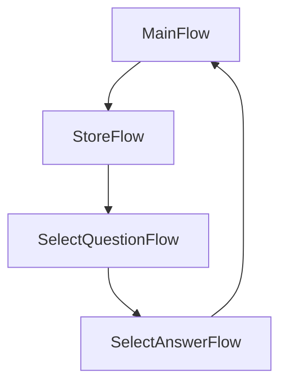
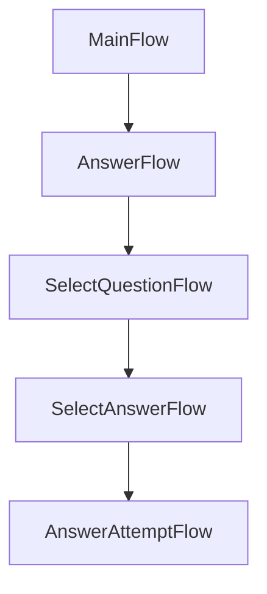

# Security Question Console App
This is a simple console application with a simple data store: LiteDb https://www.litedb.org/
Data is stored with a fast and ready hashing mechanism for some basic security, but nothing you would normally use for credential information.

## How to run
I recommend running under administration privilges.  If that isn't possible then change the StructuredLogging section in app settings.

## Design Decisions
I decided to start with a lower granularity of flow in case I wanted to do more unit testing, and to get a sense of how useful the screen and flow design could be in more complex scenarios. The solution could be greatly simplified if there was just the store and answer flow.

### Store

### Answer

## Testing Decisisons
I was not going for a high code coverage here, just verifying that I could fully test the application with this design, and to get a feel for how simple testing a flow can be.

## Slacker Plumbing
Slacker.Repository is a trimmed down updated version of a private personal nuget package currently housed in a personal Azure Devops Orginization. there is a Mongo implementation with other NoSQL stores to follow.  There are other libraries for Stored Procedures, and Bus abstractions.

## Slacker.Repository
A rest abstraction layer that can work with multiple no-sql stores including Mongo and LiteDB.  There is an EF version but slightly different. There is also a ProcedureExectuore specifically for using stored procedures and is done with Dapper

## Slacker.Logging
This is a light wrapper around Serilog to invoke

## Slacker.HostedConsole
This is a new concept for me and it shows..  The idea 
### Screen:  a collection of flows and initialized state
### Flow: a run action with user IO with a NextFlow

## TODO
1. I could see reusing the hosted console with the screen and flow design in conjunction with cli tools like dotnet, npm or angular. If so I might move the flow running method out to Slackers.HostedConsole
